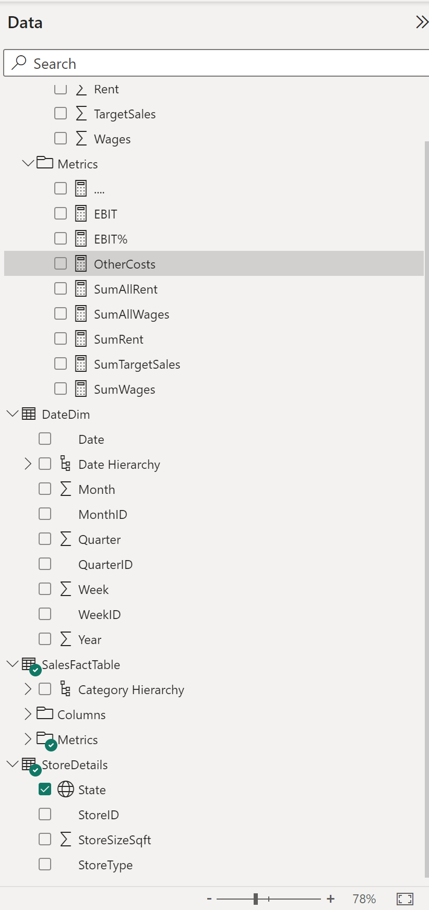

# Introduction & Goals
The following project aims to illustrate the process of leveraging semi-structured data from various sources to create an holistic yet dynamic dashboard/analysis of the company's performance. 

The subsequent steps inlude cleaning and engineering additional information through Power Query (using the M language), developing a data model within Power BI and utilising DAX to expand upon the informative content of the data. The resulting figures are then utilised to create an interactive report/dashboard deliverable. 

# Contents

- [The Data Set](#the-data-set)
- [Steps](#steps)
  - [Cleaning and Engineering](#cleaning-and-engineering)
  - [Modelling](#modelling)
  - [Analysis](#analysis)
  - [Visualization](#visualization)
- [Conclusion](#conclusion)
- [Follow Me On](#follow-me-on)
- [Appendix](#appendix)

# The Data Set
The data is semi structured in nature, providing an proxy for the result of output obtained from internal systems. This is typically where SQL would be used to query an internal database/data mart. This project does not include such queries as its primary objective is to focus on the capabilities of Power BI and its accompanying suit of applications ie Power Query and Excel.

The various files provided within this repository encompass the following information: 
- Sales retail 2017 - 2019 (sales data)
- Retail fixed costs (associated sales costs)
- Department list (nature and geographical location of stores)
- Store details (various types of goods sold at each store)

# Steps
The following provides an overview as well as visualisations of the end product.

## Cleaning and Engineering
Initial parameters are created for the sake of continuity whereby the aforementioned tables are loaded into Power Query cleaned appropriately. Actions performed on the data include the removal of rows, pivoting of columns, expanding of columns and changing of data types. All columns of data have been vetted for inconsistencies and manual M code is implemented to create a comprehensive datatime dimension named DateDim. 

## Modelling
The data is Modelled within Power Query whereby it is organised into a split star schema in order to optimise for contextual filtering. As per best practices, unecessary analytic-specific columns are hidden to prevent redundancy. 

## Analysis
A diverse array of metrics are generated and organised in folders underneath the corresponding table. As illustrated in the visuals below, careful attention is paid to the manner in which the visual context will impact the end figure (an important distinction between calculate() and filter() functions are made within the DAX code). It is worth bearing in mind the such calculations were performed in a cummulative fashion through the evoluation of the analysis. 

## Visualization
The report/dashboard is broken down into the following 3 portions: 
- An holistic overview: 

- A store category review: 

- Top sellers information: 

> All visuals are interactive within the visualisations as well as across tabs which allows the user to use the deliverable as a tool for analysis within itself. 

A custom visual is also created for the sakes of athestic appeal: 

# Conclusion
As the purpose of the project was convey my skills pertaining to the tools themselves rather than the analysis of said data. During the progression of this "assignment" of sorts I was able to ground my understanding in the concept of the the datawarehousing methodoology of organising the data in the form of fact and dimension tables. Moreover I was stunned by the analytical ability of Power BI in terms of the interoperability between the visualisations themselves. 

I would say the biggest challenge yet enjoyment of the project was the development of the manner in which I wanted to convery the data. 

# Follow Me On
[Add the link to your LinkedIn Profile](https://www.linkedin.com/in/jeremie-verdoodt-7832a4166)

# Appendix
- All data was sourced and guided through the BIDA CFI course. 
